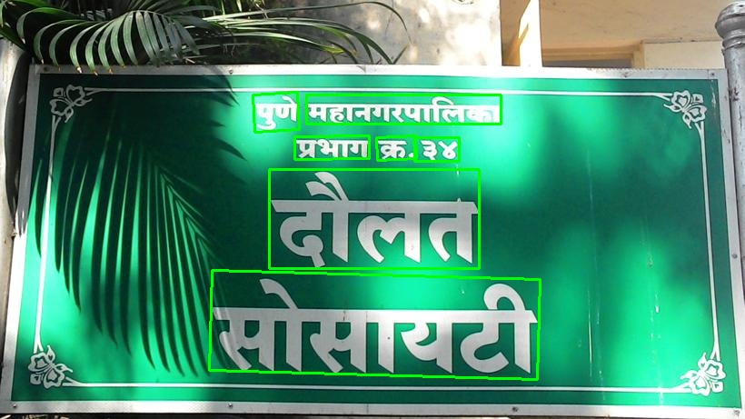
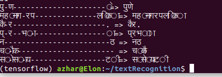

# Scene Text-Spotting based on PSEnet+CRNN

Pytorch implementation of an end to end Text-Spotter with a PSEnet text detector and CRNN text recognizer. We plan to grow this repository into an open research platform for multi-lingual text detection and recognition from natural scene images, targeted towards low-resource languages.

## Requirements
- Python 3.6.5
- Pytorch 1.2
- pyclipper
- Polygon 3.0.8
- OpenCV 3.4.1

### Demo
- Download the trained CRNN and PSEnet models from the links provided below.
- Copy paths of the models and paste them in params.py
- run end-end.py
```
python end-end.py --img [path to image] --e2e_config_name [end to end config name]
```

### Pre-trained Models

Both PSEnet and CRNN pre-trained models can be found here: [gdrive](https://drive.google.com/open?id=1Bza5tAACtqtLNLxg7ws6rzRrSeW1-Jp6)

* the PSEnet model is a multi-lingual text detector, trained on MLT 2019. Works quite well!
* the CRNN recognizes Hindi, Bangla, Malayalam, Kanada, Tamil, Telugu, Odia, Sanskrit, Marathi!

Download the models in `models/` directory and modify `params.py` if required.

### Samples






### Contributors

* Azhar Shaikh, PES University [LinkedIn](https://www.linkedin.com/in/azhar-shaikh-b61892137)
* Nishant Sinha, [OffNote Labs](https://github.com/ofnote)

Work done as part of Internship with [OffNote Labs](http://offnote.co).

### References
1. [https://github.com/whai362/PSENet](https://github.com/whai362/PSENet)
2. [https://github.com/Holmeyoung/crnn-pytorch](https://github.com/Holmeyoung/crnn-pytorch)

**If this repository helps you, please star it. Thank you!**


