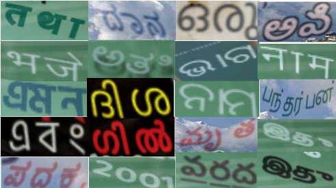

# Multi-Lingual Text Recognition
Pytorch code to train scene text recognition models for Indic languages

## MLT19 format to lmdb conversion 

Run the following commands if the data is in MLT19 format. If the data is already in lmdb format skip to *Data Setup*.

 ``` 
python prepare_data.py --image_dir path/to/SceneImages --image_gt_dir path/to/SceneImage_gt --word_image_dir path/to/store/cropped/text/images --output_path path/to/store/lmdb_gt --lang language to generate gt for
```
```
python create_lmdbdataset.py --gtFile path/to/lmbd_gt --outputPath folder/to/store/lmdb_data
```

## Data Setup

- To get the train-test split, run
```
python train_test_split_lmdb.py --lmdb_data_path path/to/lmdb_data
```
- Set up data directories as specified in [this](dataDirStruct.txt) file.

- Synthetic data for several Indic languages, in the desired format, can be obtained from [here](https://www.kaggle.com/azharshaikh/synthtextgen).

## Training

- Refer to Config.py on how to setup a config for an experiment run
- To start training run
```
python train.py --task_config_name <name of the config>
```
## Adding new language head 
To add a new language head append character set of new language to the [characters.txt](characters.txt) file.
## Baselines on Indic Synthetic Data 
| Language | Word Accuracy (%) | N-ED (%) | Model |
| - | - | - | - |
|Hindi(hin)|45.00|65.50|[gdrive](https://drive.google.com/drive/folders/18GOxa8VZKTipkQwQC7-229diXGSYnsjb?usp=sharing)|
|Bangla(ban)|74.00|87.50|[gdrive](https://drive.google.com/drive/folders/18GOxa8VZKTipkQwQC7-229diXGSYnsjb?usp=sharing)|
|Kanda(kan)|56.00|77.50|[gdrive](https://drive.google.com/drive/folders/18GOxa8VZKTipkQwQC7-229diXGSYnsjb?usp=sharing)|
|Malayalam(mal)|61.00|75.00|[gdrive](https://drive.google.com/drive/folders/18GOxa8VZKTipkQwQC7-229diXGSYnsjb?usp=sharing)|
|Marathi(mar)|50.50|72.50|[gdrive](https://drive.google.com/drive/folders/18GOxa8VZKTipkQwQC7-229diXGSYnsjb?usp=sharing)|
|odia(odia)|37.50|61.20|[gdrive](https://drive.google.com/drive/folders/18GOxa8VZKTipkQwQC7-229diXGSYnsjb?usp=sharing)|
|Sanskrit(sans)|82.00|91.00|[gdrive](https://drive.google.com/drive/folders/18GOxa8VZKTipkQwQC7-229diXGSYnsjb?usp=sharing)|
|Tamil(tam)|58.00|77.00|[gdrive](https://drive.google.com/drive/folders/18GOxa8VZKTipkQwQC7-229diXGSYnsjb?usp=sharing)|
|Telugu(tel)|51.00|80.00|[gdrive](https://drive.google.com/drive/folders/18GOxa8VZKTipkQwQC7-229diXGSYnsjb?usp=sharing)|
## Baselines on Indic languages in ICDARMLT19 data
| Language | Word Accuracy (%) | N-ED (%) |
| - | - | - |
|Hindi(hin)|47.80|86.00|
|Bangla(ban)|45.80|78.00|


